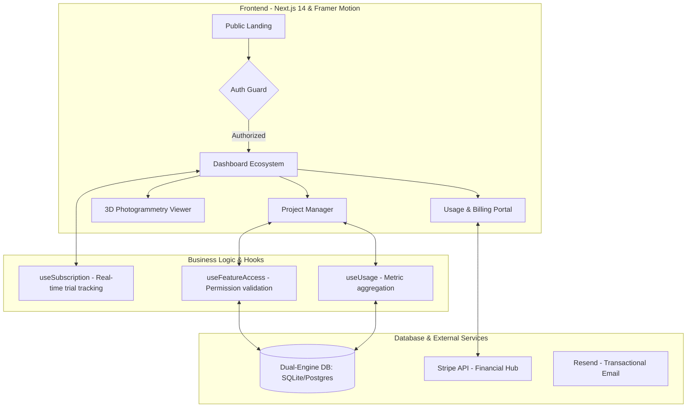
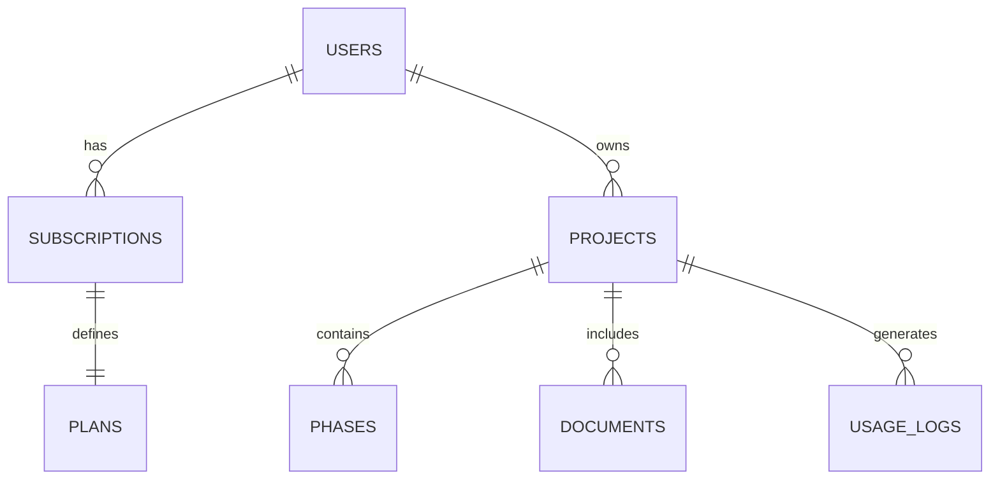

<div align="center">
  

  # 🏛️ ChronoStone SaaS Engine
  ### **The Future of Heritage Conservation & Management**
  
  *An advanced ecosystem for digital preservation, 3D photogrammetry visualization, and stone-heritage restoration management.*

  <br />

  [](https://nextjs.org/)
  [](https://www.typescriptlang.org/)
  [](https://tailwindcss.com/)
  [](https://www.framer.com/motion/)
  [](https://www.postgresql.org/)

</div>

---

## 🚀 Visión General
ChronoStone no es solo un gestor de proyectos; es un **Smart OS para Monumentos**. Permite a historiadores, arquitectos y conservadores centralizar toda la vida útil de una pieza de patrimonio, desde su escaneo 3D inicial hasta su última fase de restauración.

---

## 🛠️ Arquitectura del Sistema

Hemos diseñado una arquitectura modular que separa el estado de la suscripción de la lógica de negocio, permitiendo una escalabilidad horizontal.

### Flujo de Datos y Operaciones


---

## 💎 Características de Élite

### 🏗️ Gestión de Restauración Avanzada
*   **Pipeline de Fases**: Control detallado de cronograma para restauraciones complejas.
*   **Document Management**: Gestor documental especializado en informes técnicos y analíticas de piedra.
*   **Colaboración Multi-perfil**: Roles específicos para conservadores, inversores y auditores.

### 🛡️ Motor de Acceso y Límites (Premium)
Hemos programado un sistema de **"Feature Gating"** proactivo:
*   **Dynamic Usage Gauges**: Indicadores visuales en tiempo real del consumo de recursos.
*   **Grace Period Handling**: Lógica inteligente para periodos de prueba expirados.
*   **Unlimited Scalability**: Soporte nativo para planes Enterprise con recursos infinitos (`∞`).

### 🧬 Base de Datos Dual (Agile Development)
Capacidad única de alternar entre motores sin cambiar una sola línea de código de negocio:
*   **SQLite-Better**: Para desarrollo ultrarrápido y testing local.
*   **Neon PostgreSQL**: Conectividad Serverless para producción de alta disponibilidad.
*   **SQL Migration Engine**: Scripts automatizados que garantizan la paridad de esquemas.

---

## 📊 Modelo de Datos (Core Entities)

El esquema de la base de datos está optimizado para la trazabilidad histórica:



---

## 🔧 Guía de Despliegue Avanzado

```bash
# Instalación del entorno
npm install

# Configuración de base de datos dual
# Solo necesitas correr esto para tener el sistema listo
npm run db:setup
npm run db:migrate

# Creación de entorno de pruebas (Superadmin)
npm run db:superadmin

# Lanzamiento con Hot-Reload
npm run dev
```

---

## 🛣️ Roadmap de Ingeniería

### Fase 1: Cimentación (Completada) ✅
*   Arquitectura Next.js App Router.
*   Sistema de Auth con NextAuth.
*   Gestión de suscripciones y límites.

### Fase 2: Visualización y 3D (En Proceso) 🚧
*   Implementación de **Three.js** para carga de modelos `.obj` y `.glb`.
*   Anotaciones espaciales sobre modelos históricos.

### Fase 3: Inteligencia Artificial (Q3 2025) 🔮
*   Detección de patologías mediante Computer Vision.
*   Predicción de costes de restauración basada en histórico.

---

## 👨‍💻 Acerca del Autor

**ivannr23** - Lead Developer
> *"Convertir la herencia física en un activo digital eterno."*

[GitHub](https://github.com/ivannr23) | [LinkedIn](https://www.linkedin.com/in/ivannavarroramos/) | [Portfolio](https://chronostone.dev)

---

<div align="center">
  <sub>Built with high-performance standards in Next.js 14</sub>
  <br />
  
</div>
