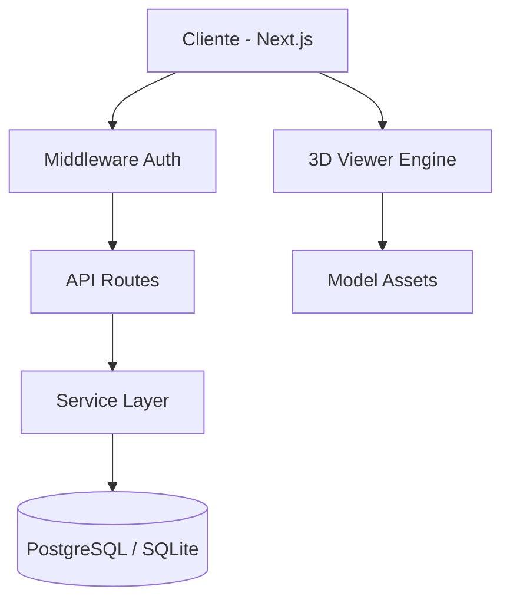

<div align="center">
  

  # 🏛️ ChronoStone
  ### *Digitalizing Heritage. Preserving History.*

  [](https://nextjs.org/)
  [](https://www.typescriptlang.org/)
  [](https://tailwindcss.com/)
  [](https://www.framer.com/motion/)
  [](https://www.postgresql.org/)

  **ChronoStone** es una plataforma SaaS integral diseñada para la gestión, visualización y preservación digital del patrimonio histórico. Combina potencia de gestión de proyectos con visualización 3D avanzada.
</div>

---

## ✨ Características Principales

### 📁 Gestión de Proyectos de Restauración
Control total sobre expedientes, fases y documentación técnica. Diseñado específicamente para los flujos de trabajo de conservación.

### 🎮 Visor 3D Integrado
Carga y visualiza modelos fotogramétricos de alta resolución directamente en tu navegador. Compatible con los formatos estándar del sector.

### 💰 Gestión de Subvenciones e Inversión
Monitoriza convocatorias públicas, plazos de solicitud y justificación de fondos en tiempo real para cada monumento.

### 📉 Panel de Control Inteligente
Estadísticas detalladas, seguimiento de uso y alertas tempranas para el mantenimiento preventivo de bienes culturales.

---

## 🛠️ Stack Tecnológico

| Área | Tecnologías |
| :--- | :--- |
| **Frontend** | React 18, Next.js 14, Tailwind CSS, Lucide Icons |
| **Animaciones** | Framer Motion (Transiciones fluidas y micro-interacciones) |
| **Backend** | Next.js API Routes, NextAuth.js |
| **Base de Datos** | PostgreSQL (Neon) / SQLite (Development) |
| **3D Engine** | React Three Fiber / Three.js |

---

## 🚀 Inicio Rápido

### Requisitos Previos
- Node.js (v18+)
- npm / pnpm / yarn

### Instalación

1. **Clonar el repositorio**
   ```bash
   git clone https://github.com/ivannr23/ChronoStone.git
   cd ChronoStone
   ```

2. **Instalar dependencias**
   ```bash
   npm install
   ```

3. **Configurar el entorno**
   Copia el archivo de ejemplo y rellena tus credenciales:
   ```bash
   cp .env.example .env.local
   ```

4. **Inicializar la Base de Datos**
   ```bash
   npm run db:setup
   npm run db:migrate
   npm run db:superadmin
   ```

5. **¡A Correr!**
   ```bash
   npm run dev
   ```

---

## 🏗️ Arquitectura del Sistema



---

## 👨‍💻 Autor

**ivannr23**
- GitHub: [@ivannr23](https://github.com/ivannr23)
- Email: [ivannavarroramos@gmail.com](mailto:ivannavarroramos@gmail.com)

---

<div align="center">
  <sub>Construido con ❤️ para la preservación de nuestra historia digital.</sub>
</div>
